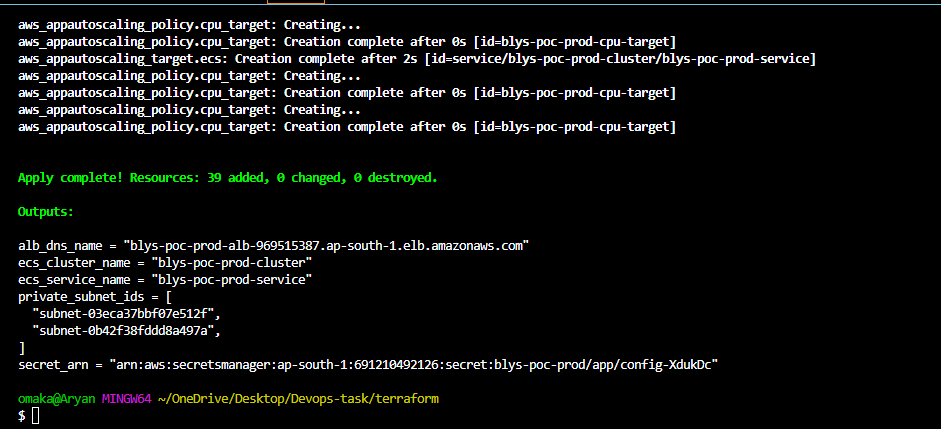
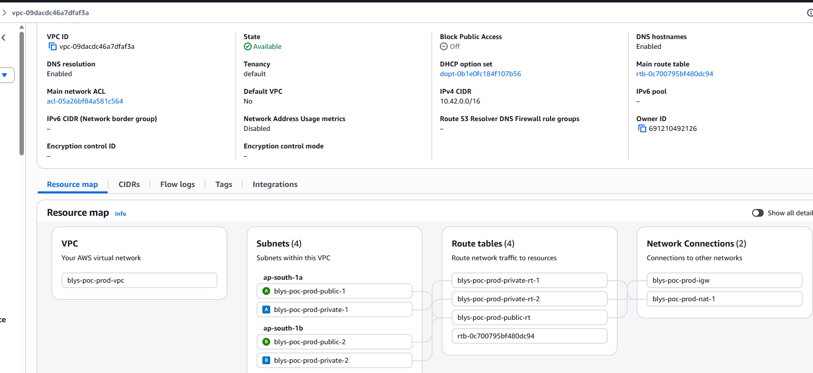
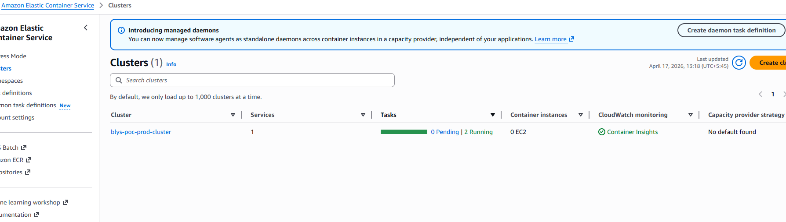
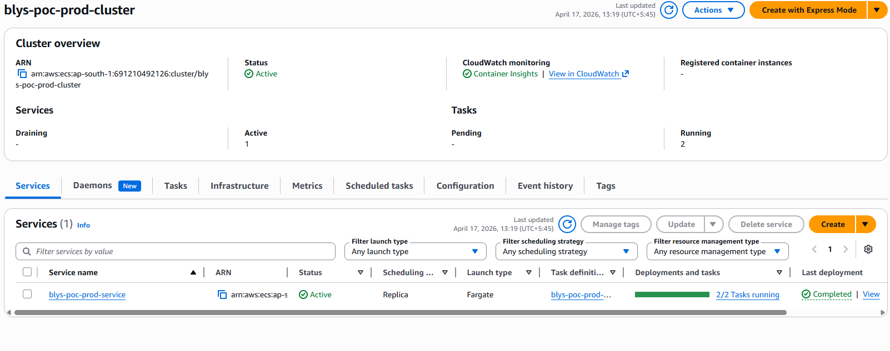
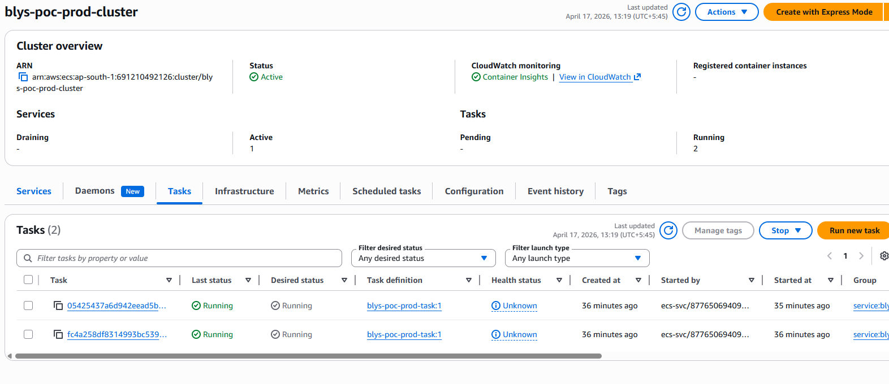
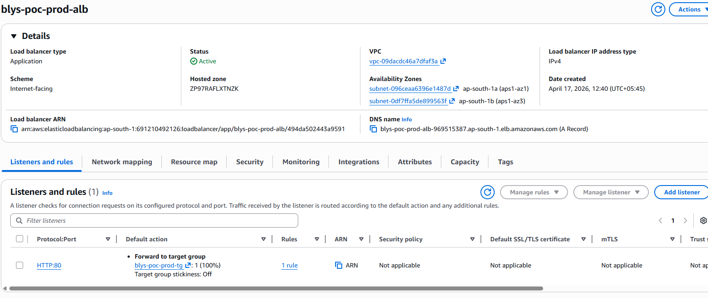
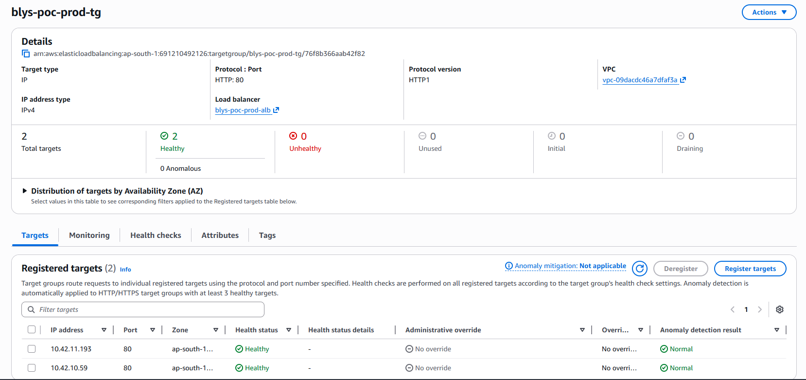
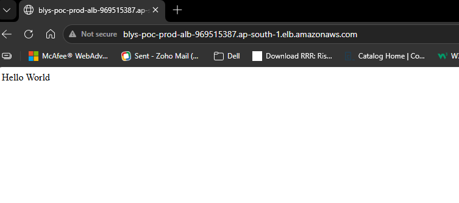
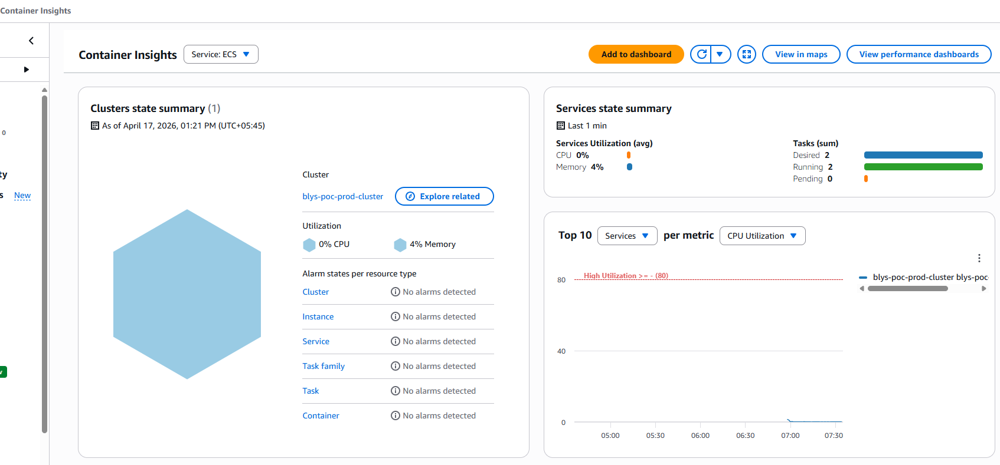
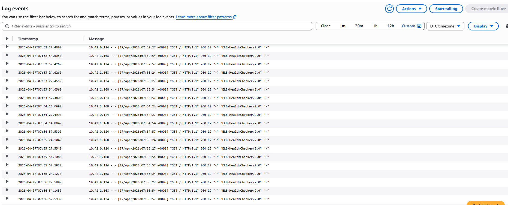

# Blys DevOps Challenge: Production-Ready Infrastructure PoC

## Overview
The goal of this PoC is to show a design that is small enough to understand quickly, but still reflects real production thinking around security, availability, cost, and operability.

## What This Deploys

- 1 VPC with DNS support enabled
- 2 public subnets across 2 Availability Zones
- 2 private subnets across 2 Availability Zones
- 1 Internet Gateway
- NAT Gateway support with a cost vs resilience toggle
- 1 ECS cluster using Fargate
- 1 ECS service running a simple web container
- 1 Application Load Balancer spanning both public subnets
- Least-privilege security groups and security group rules
- 1 Secrets Manager secret
- IAM execution and task roles for ECS
- 1 CloudWatch log group for container logs
- ECS service autoscaling based on CPU utilization

## Architecture Summary

- The ALB is internet-facing and attached to both public subnets.
- ECS tasks run in private subnets and do not receive public IPs.
- Private subnet egress is provided through NAT.
- The service runs across two Availability Zones for higher availability.
- The ALB forwards HTTP traffic to healthy ECS tasks only.
- Secrets are stored in AWS Secrets Manager instead of being hardcoded.

## Tested Deployment

This stack was successfully applied in AWS and verified end to end.

### Verified Outcomes

- Terraform apply completed successfully
- The VPC and subnet layout was created as expected
- The ECS cluster and ECS service were created successfully
- The ALB was provisioned and returned a public DNS name
- The application was reachable through the ALB and returned `Hello World`

### Example Outputs Observed During Testing

- ALB DNS:
  `blys-poc-prod-alb-969515387.ap-south-1.elb.amazonaws.com`
- ECS cluster:
  `blys-poc-prod-cluster`
- ECS service:
  `blys-poc-prod-service`

## Folder Structure

- `versions.tf`
  Terraform and provider version constraints
- `providers.tf`
  AWS provider configuration and tagging
- `variables.tf`
  Input variables for network, compute, and security tuning
- `main.tf`
  Core infrastructure resources
- `outputs.tf`
  Useful deployment outputs
- `terraform.tfvars.example`
  Example variable values for local testing

This is intentionally kept as a simple single-stack layout for readability in a take-home task. If this were extended further, a natural next step would be to split it into modules such as `network`, `security`, and `compute`.

## How To Run

### Prerequisites

- Terraform 1.5+
- AWS account access
- AWS credentials configured locally through AWS CLI

### AWS Credentials

One simple option is:

```bash
aws configure
```

Then confirm the target account and region are correct before applying.

### Deployment Steps

1. Copy the example variables file:

```bash
cp terraform.tfvars.example terraform.tfvars
```

2. Update the values as needed:

- set `secret_value`
- set the desired AWS region
- optionally restrict `allowed_ingress_cidrs`

3. Run Terraform:

```bash
terraform init
terraform plan
terraform apply
```

4. After apply completes, get the ALB DNS name:

```bash
terraform output alb_dns_name
```

5. Open the ALB DNS name in a browser to test the application.

## Design Decisions

### Networking and Fault Tolerance

- 2 public subnets are used for the ALB and NAT placement
- 2 private subnets are used for the ECS application tier
- Resources are spread across 2 Availability Zones
- The ECS service starts with a desired count of 2 so one task can run in each AZ under normal conditions

### NAT Gateway Strategy

The design supports two NAT modes:

- `single`
  Lower cost, but AZ-level outbound resilience is reduced
- `one_per_az`
  Higher cost, but better availability and AZ alignment

For this PoC, `single` NAT is the default because it is the more pragmatic choice for a cost-aware challenge submission. The code still supports `one_per_az` if the uptime requirement becomes stricter.

### Security

- ECS tasks run only in private subnets
- The ALB is the only public entry point
- ECS tasks accept inbound traffic only from the ALB security group
- Security group egress is explicitly defined
- Secrets are stored in Secrets Manager
- No AWS credentials are hardcoded in Terraform
- IAM permissions are scoped to the specific secret instead of wildcard access

### Compute and Scaling

- ECS Fargate is used to avoid EC2 management overhead
- The ECS service maintains the desired task count automatically
- Application Auto Scaling adjusts the service based on average CPU utilization

## Mapping to the Challenge Requirements

### Technical Requirements

- `VPC with public and private subnets`
  Implemented with 2 public and 2 private subnets
- `ECS cluster running a Hello World container`
  Implemented with ECS Fargate and an nginx-based hello-world container
- `Application Load Balancer`
  Implemented with a public ALB, listener, and target group
- `Security Groups with least privilege`
  Implemented with ALB-to-ECS-only application flow
- `2 public and 2 private subnets`
  Implemented
- `NAT Gateway setup balancing HA with cost`
  Implemented through configurable NAT mode
- `Multi-AZ design`
  Implemented across 2 Availability Zones
- `Secrets Manager or SSM`
  Implemented with AWS Secrets Manager
- `IAM role with least privilege`
  Implemented for ECS execution and task roles
- `Compute with scaling`
  Implemented using ECS service autoscaling

## Common Troubleshooting Checks

### ALB Returns 5xx or Page Does Not Load

- check the ECS service events
- confirm targets are healthy in the ALB target group
- verify the ECS tasks are running
- confirm the ECS service security group still allows traffic from the ALB security group

### ECS Tasks Fail To Start

- inspect ECS service events
- review CloudWatch logs
- verify the container image is available
- confirm IAM permissions still allow required secret access

### ECS Tasks Have No Outbound Access

- confirm NAT Gateway health
- verify private route tables still point to the correct NAT Gateway
- confirm the ECS security group egress rules still allow HTTP and HTTPS outbound traffic

### Secret Access Problems

- confirm the secret still exists in Secrets Manager
- verify the ECS execution role and task role policies
- confirm the task definition still references the expected secret ARN

## Future Improvements

These are not required for the current PoC, but they are the next production-grade improvements I would make:

- HTTPS with ACM instead of HTTP-only ALB
- Remote Terraform state in S3
- DynamoDB state locking for safer team collaboration
- CloudWatch alarms for ALB and ECS health
- Terraform modules for clearer separation of network, security, and compute concerns

### Remote State and Locking Recommendation

For this submission, Terraform is being run locally without remote backend configuration because the focus was on the core infrastructure requirements and successful end-to-end deployment.

In a real shared environment, I would move the Terraform state to:

- S3 for centralized remote state storage
- DynamoDB for state locking

That helps because it:

- avoids local state drift between engineers or CI jobs
- prevents concurrent `terraform apply` operations
- makes collaboration safer
- gives better operational continuity if one machine is lost

A clean implementation path would be:

1. create a dedicated S3 bucket for Terraform state
2. enable bucket versioning
3. create a DynamoDB table with `LockID` as the partition key
4. configure an S3 backend in Terraform with the bucket, key, region, and DynamoDB table
5. migrate local state using `terraform init -migrate-state`

## Screenshots

- `terraform apply` output showing successful resource creation



- AWS VPC resource map showing the 2 public and 2 private subnets across 2 Availability Zones



- ECS cluster and ECS service view showing the service is active







- ALB details page showing the public DNS name



- Target group health showing healthy registered ECS targets



- Browser screenshot showing the ALB DNS endpoint returning `Hello World`



- CloudWatch log group or log stream screenshot showing application logs




